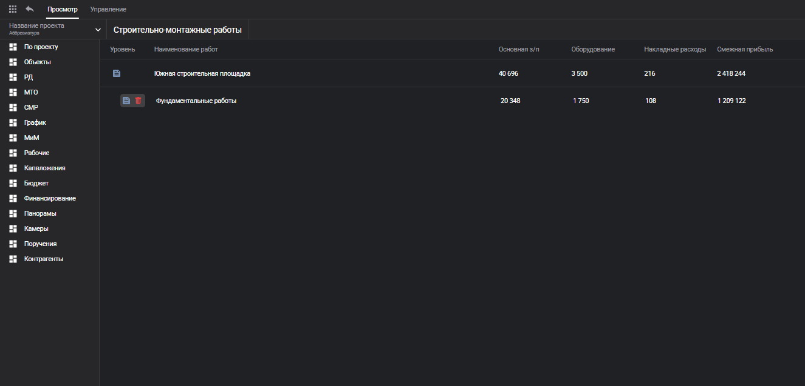

# 📌 Work flow manager — React.js + TypeScript + Redux-toolkit




## 📖 Описание
Work Flow Manager — это приложение для управления расходами и финансовыми данными. В приложении можно получать, добавлять, удалять и редактировать информацию о расходах, доходах и других числовых показателях.
<br></br>
🔹 **Технологии:** 
- Html
- Scss
- React.js
- TypeScript
- Redux-toolkit
- Vite
- API - Swagger UI
<br></br>

🔹 **Функционал:** 
- Создание, удаление, редактирование данных в таблице
- Добавление вложенной таблицы
- Подсчет общей сумму в родительской таблице
- Работа с LocalStorage
- Работа с API через RTK-Query
<br></br>
## ✅ Что реализовано / ❌ Чего нет

| Фича         | Статус |
|-------------|--------|
| 🧵 SCSS | ✅ |
| ⚡ Vite | ✅ |
| ⚛️ React | ✅ |
| 🚀 Next.js | ❌ |
| 🔷 TypeScript | ✅ |
| 📦 Redux-toolkit | ✅ |
| 🔄 Работа с API | ✅ |
| 🎭 Тесты (Jest) | ❌ |
| 🎨 Адаптивный дизайн | ❌ |

## 🚀 Как запустить проект

1. **Склонируйте репозиторий:**
   ```sh
   git clone https://github.com/Zakir-2-3/Work_flow_manager.git
   cd App_for_tests
   ```

2. **Установите зависимости:**
   ```sh
   npm install
   ```

3. **Запустите проект:**
   ```sh
   npm run dev
   ```

4. Откройте в браузере ссылку ~ `http://localhost:5173/` (ссылка может отличаться)

## 🛠️ Основные команды

| Команда | Описание |
|---------|----------|
| `npm run dev` | Запуск проекта в режиме разработки |
| `npm run build` | Сборка проекта для продакшена |
| `npm run lint` | Проверка кода на ошибки |

## 📌 Дополнительно
- **Дизайн макет 🎨:** &nbsp; [Figma](https://www.figma.com/file/00XiX4Vr1CAhGCkj8sWGGK?node-id=0:1&locale=en&type=design)
- **Текущий проект 👀:** &nbsp; ❌

💡 **Есть идеи или вопросы?** Открывайте issue или предлагайте pull request!
